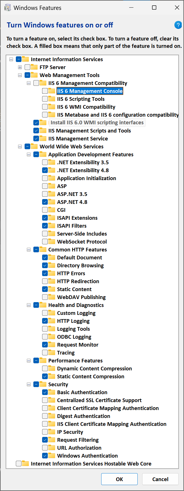

Contributing to JJ.Framework
============================

__📔 Contents__

- [Architecture](#architecture)
- [Legacy](#legacy)
- [Branching](#branching)
- [Deployment](#deployment)
- [Versioning](#versioning)
- [Namespaces](#namespaces)
- [Immutability](#immutability)
- [New Extensions](#new-extensions)
- [Copies from "New"](#copies-from-new)
- [Conclusion about Legacy](#conclusion-about-legacy)
- [Deployment](#deployment-1)
- [Dev Env](#dev-env)
- [SQL Server](#sql-server)
- [Internet Information Services (IIS)](#internet-information-services-iis)
- [Checking Out Old Commits](#checking-out-old-commits)


Architecture
------------

The project follows [JJ's Software Architecture](https://github.com/jjvanzon/JJs-Reference-Architecture).


Legacy
------

Development under special "legacy" constraints that affect versioning, branching, and framework targeting. It's a bit unconventional and needs a more detailed explanation than usual.


Branching
---------

- The original `main` branch is now called `legacy`.
- The new `main` branches off from an older point in that `legacy` history.
- Why the throwback? We're "replaying" the past to unearth hidden gems that never saw the light of day. This lets us retroactively release not just libraries but entire applications otherwise lost.
- __The `legacy` branch shall not be deleted! The `legacy` shall remain!__


Deployment
----------

- Around `2018`, about `15` projects were released from `legacy` to `NuGet` for `.NET 4.6.1`, compatible with the now-retired `Mono` compiler.
- Now, new deployments use `.NET 9` at their core (with `.NET Standard` for compatibility), and we push updated legacy versions incrementally to `NuGet.org`.


Versioning
----------

- Code from the legacy branch compiled under `.NET 9` begins with a zero, e.g. `0.250.1053`.
- That leading `0` signals it's essentially a "prequel" to the versions already in the `1.5.x` range on `NuGet`.
- The `.Core`-suffixed projects are released with versions in the range of `1.8.x`, signaling the continuation of the `legacy` ones versioned `1.5.x`.


Namespaces
----------

Here's our naming scheme to juggle both old and new:

```
JJ.Framework.Configuration
JJ.Framework.Configuration.Net48
JJ.Framework.Configuration.Core
```

- Suffix-free (`JJ.Framework.Configuration`):  
  Directly pulled from the `legacy` branch, now upgraded for `.NET 9` and `.NET Standard`.
- `.Net48` (`JJ.Framework.Configuration.Net48`):  
  The same code, compiled for `.NET Framework 4.8`, so older systems aren't left behind.
- `.Core` (`JJ.Framework.Configuration.Core`):  
  Either brand-new development or code copied from the __latest__ `legacy` code. This way, we don't stifle innovation while we're working with legacy code.


Immutability
------------

Projects without a suffix, like `JJ.Framework.Configuration`, are to remain mostly untouched, aside from absolutely necessary fixes. If we tweak them too much, future merges from `legacy` could devolve into painful merge conflicts. So, the unwritten rule: __keep changes minimal__ to preserve easy integration of subsequent `legacy` pulls.


New Extensions
--------------

`.Core`-suffixed projects can evolve freely. We don't want to halt new development just because our main code hails from the past. This is where all new features or functionality that never existed in `legacy` can be added.


Copies from "New"
-----------------

`.Core` may also contain code cherry-picked from the newest commits in the `legacy` branch. We started our new `main` from an older snapshot, yet there's valuable stuff in later commits. By incorporating that into `.Core`, we get all the sweet stuff out there that we want.


Conclusion about Legacy 
-----------------------

Although these rules may feel restrictive, they help us continue to pull updates from our `legacy` history, and still modernize each project. The `legacy` shall remain, but new developments can thrive right alongside it!


Deployment
----------

- `Azure Pipelines` is there for `Build` and `Release` pipelining, with limited access to the deployment buttons.
- Eventually pakcages are deployed on [`NuGet`](https://www.nuget.org/profiles/jjvanzon), but there are stages before that.
- Pre-release versions are deployed to [`JJs-Pre-Release-Package-Feed`](
https://dev.azure.com/jjvanzon/JJs-Software/_artifacts/feed/JJs-Pre-Release-Package-Feed)
- And to [`JJs-Dev-Package-Feed`](https://dev.azure.com/jjvanzon/JJs-Software/_artifacts/feed/JJs-Dev-Package-Feed) for high paced development updates.
- Add these feeds to your Visual Studio under `Menu > Tools > Options > NuGet Package Manager > Package Sources`
- Further instructions: click on `Connect to Feed` after following one of the links above.


Dev Env
-------

- `Visual Studio Community 2019` or `2022` is needed to develop this project, which can be downloaded for free from `Microsoft`.
- Several `.NET SDK` versions might be needed to compile, which can also be downloaded from `Microsoft`. Be sure you use the `SDK` or `Development Pack` ones, not the `Targeting Packs` or `Runtime` versions.


SQL Server
----------

SQL Server *is* used by some of the automated tests, but they may fail gracefully with an inconclusive result. Anyway, the database files may or may not even be included in this code base either.


Internet Information Services (IIS)
-----------------------------------

- Some projects need `Internet Information Services (IIS)`.
- They might not load otherwise.
- You can enable `IIS` with "Turn Windows features on or off" (search in the `Start` menu).
- The following options have been known to work on `Windows 11`:  
  
- Create a web site for each of the relevant projects below.
- Also change the `Windows hosts` file. Each site added to `IIS` might need to be mentioned in the file `C:\Windows\System32\drivers\etc\hosts`.
- Try *reloading* a web project:
- The Output window in `Visual Studio` might show an expected web address.
- Here follow suggestions for each of the sites to create and their settings.
- (Physical path root folder `C:\Repositories\JJ.Framework` may vary.)

-----

- __JJ.Framework.Soap.Tests.Server__

    - C# project:
        - `JJ.Framework.Soap.Tests.Server.csproj`
    - IIS site name:
        - `TEST_JJ.Framework.Soap.Tests.Server`
    - IIS site physical path:
        - `C:\Repositories\JJ.Framework\Framework\Soap.Tests.Server`
    - IIS site binding host name:
        - `test.jj-framework-soap.jjvanzon.io`
    - hosts file entries:
        - `127.0.0.1  test.jj-framework-soap.jjvanzon.io`
        - `::1        test.jj-framework-soap.jjvanzon.io`

- __JJ.Demos.ReturnActions.NoViewMapping.Mvc.UrlParameter__

    - C# project:
        - `JJ.Demos.ReturnActions.NoViewMapping.Mvc.UrlParameter.csproj`
    - IIS site name:
        - `DEV_JJ.Demos.ReturnActions.NoViewMapping.Mvc.UrlParameter`
    - IIS site physical path:
        - `C:\Repositories\JJ.Framework\Demos\ReturnActions.NoViewMapping.Mvc.UrlParameter`
    - IIS site binding host name:
        - `demo-ret-noviewmapping-urlparameter.jjvanzon.io`
    - hosts file entries:
        - `127.0.0.1  demo-ret-noviewmapping-urlparameter.jjvanzon.io`
        - `::1        demo-ret-noviewmapping-urlparameter.jjvanzon.io`

- __JJ.Demos.ReturnActions.WithViewMapping.Mvc.PostData__

    - C# project:
        - `JJ.Demos.ReturnActions.WithViewMapping.Mvc.PostData.csproj`
    - IIS site name:
        - `DEV_JJ.Demos.ReturnActions.WithViewMapping.Mvc.PostData`
    - IIS site physical path:
        - `C:\Repositories\JJ.Framework\Demos\ReturnActions.WithViewMapping.Mvc.PostData`
    - IIS site binding host name:
        - `demo-ret-withviewmapping-postdata.jjvanzon.io`
    - hosts file entries:
        - `127.0.0.1  demo-ret-withviewmapping-postdata.jjvanzon.io`
        - `::1        demo-ret-withviewmapping-postdata.jjvanzon.io`

- __JJ.Demos.ReturnActions.WithViewMapping.Mvc.UrlParameter__

    - C# project:
        - `JJ.Demos.ReturnActions.WithViewMapping.Mvc.UrlParameter.csproj`
    - IIS site name:
        - `DEV_JJ.Demos.ReturnActions.WithViewMapping.Mvc.UrlParameter`
    - IIS site physical path:
        - `C:\Repositories\JJ.Framework\Demos\ReturnActions.WithViewMapping.Mvc.UrlParameter`
    - IIS site binding host name:
        - `demo-ret-withviewmapping-urlparameter.jjvanzon.io`
    - hosts file entries:
        - `127.0.0.1  demo-ret-withviewmapping-urlparameter.jjvanzon.io`
        - `::1        demo-ret-withviewmapping-urlparameter.jjvanzon.io`


Checking Out Old Commits
------------------------

`JJ.Framework` was once part of a larger code base. It was extracted to become a new Git repository with history in tact. Some quirks when checking out older history items, still have to do with that.

Sometimes commit comments may mention *apps* that do not seem to be relevant to the `JJ.Framework`. That is because changes to `JJ.Framework` were in service of making a feature in another app.

The following may only be relevant when getting older commits from history (from before 2018-12-02).

- No solution file in the first commits.
    - `JJ.Framework` projects were first only referenced by the solution of the app it was made for. Those solutions are not be in the history here, so the first commits may have no solution file.
- `JJ.sln` references non-existent projects.
    - Before `JJ.Framework` was open-sourced, there might not have been a `JJ.Framework.sln`.
    - However, what you might find there is a `JJ.sln`, broader in scope.
    - However it would include projects from other apps too.
    - It might still build even though some projects may not load.
- Missing *NHibernate SQL Logger* files.
    - *NHibernate SQL Logger* was made in  employer's time, but programmed into the `JJ.Framework`. It was removed out of the `JJ.Framework` to avoid intellectual property issues.
    - Remove references to non-existent files.
    - Remove the pieces of code that use `if (SqlLogger.Enabled)` and it will work.
- *.NET Framework* mismatches:
    - These errors may have slipped in, by not consistently building all solutions upon committing code.
    - The symptom would be compiler errors. `csproj` references may appear not to work, even when the references are obviously there.
    - Correct the `csproj` with the lower `.NET` version (e.g. `3.5`) to use the higher `.NET` version instead (e.g. `4.5`).
- *MVC Framework*
    - Mismatches `4.0.0.0` vs `4.0.0.1`.
    - Correct it so the projects use the same version (using NuGet).
- *Entity Framework*
    - It seems difficult for a newer *Visual Studio* to find (the older) *Entity Framework 5*. Messing around until you got some working references to Entity Framework might be the only advice at hand here.
