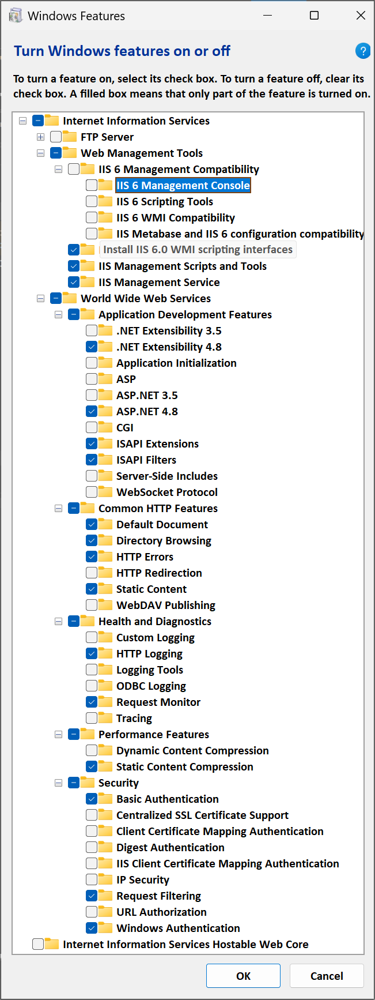

🔩 JJ.Framework
================

<h2>📔 Contents</h2>

- [📢 Introduction](#-introduction)
- [🏋️ Stability](#️-stability)
- [🏡 In-House](#-in-house)
- [🏛️ History](#️-history)
- [🍱 Modularization](#-modularization)
- [💁 Platform Compatibility](#-platform-compatibility)
- [⚙ Setting Up Dev Environment](#-setting-up-dev-environment)
    - [💿 WiX Toolset (Windows Installer XML Toolset)](#-wix-toolset-windows-installer-xml-toolset)
    - [📲 .NET 4.6.1](#-net-461)
    - [📦 JJ.Framework](#-jjframework-1)
    - [🌐 Internet Information Services (IIS)](#-internet-information-services-iis)
    - [💽 SQL Server](#-sql-server)
- [🧓 Checking Out Old Commits](#-checking-out-old-commits)

📢 Introduction
----------------

`JJ.Framework` are extensions of the `.NET Framework`: the nuts, bolts and screws of software development: *reusable components*. Some of which might be expected to be there in `.NET`, but seem to be missing there.

`JJ.Framework` contains reusable code, that was produced along with real-life applications.

🏋️ Stability
-------------

No software is bug free, but extra effort was made, testing the `JJ.Framework` components, that were published to [NuGet](https://www.nuget.org/profiles/jjvanzon) which includes automated testing.

The ones not on NuGet are available as a sneek peek in [JJs-Pre-Release-Package-Feed](https://dev.azure.com/jjvanzon/JJs-Software/_packaging?_a=feed&feed=JJs-Pre-Release-Package-Feed). But those may be used with caution, because they may not be tested that well. Those may need some more unit testing and could still be a bug or two in it.

🏡 In-House
------------

`JJ.Framework` was made in the spirit of: small things: develop your own, instead of importing a huge framework.

`JJ.Framework` components are compact: a couple of kilobytes each.

Developed *in-house* so that it could be adapted and extended as needed. It did not have to be complete, because then we would just extend it.

If a bug was found in the development of an app, we could just correct the `JJ.Framework` as needed and release a stable app.

Of course, this 'in-house development' argument does not apply, when other people use it. But I think these extensions could be of use to others too.

🏛️ History
-----------

Any reusable code independent of a particular business domain, was moved to this `JJ.Framework`, for reuse. The reusable code was gathered up between 2010 and 2020. It was a hobby project. But something similar to this framework, was also developed professionally in a team of 7 of which I was the technical lead at the time.

🍱 Modularization
------------------

`JJ.Framework` tends to have a separate assembly for each part of the `.NET Framework` that it extends. Separation may be found between technical aspects. That may allow being specific, on which parts of `.NET` an application becomes dependent.

`JJ.Framework` also likes decouple platform-specific implementation details and hide them behind generalized interfaces.

💁 Platform Compatibility
--------------------------

That grip on dependency, was once a good plan for platform compatibility. `JJ.Framework` may currently be based on `.NET 4.6.1` trying to keep it compatible with Mono. Around 2015 `JJ.Framework` was tested to be reasonably compatible with Mono and by extension Android, iOS and Windows Phone. This was before newer technology like `.NET Standard` and more recently `.NET 5` and up, which might make keeping things platform-compatible a bit easier than before. For this reason, there may be plans to port `JJ.Framework` to `.NET 5` or higher once, but  this currently isn't in the plans.

⚙ Setting Up Dev Environment
--------------------------

### 💿 WiX Toolset (Windows Installer XML Toolset)

Install the following:

- WiX Toolset: "wix311.exe" <https://github.com/wixtoolset/wix3/releases/tag/wix3112rtm>
- WiX v3 - Visual Studio 2022 Extension: "Votive2022.vsix" <https://marketplace.visualstudio.com/items?itemName=WixToolset.WixToolsetVisualStudio2022Extension>

### 📲 .NET 4.6.1

The old .NET version with which these projects were built. Origally this choice guaranteed platform compatibility. Download here:

<https://dotnet.microsoft.com/en-us/download/dotnet-framework/net461>

### 📦 JJ.Framework

- Pre-release versions of `JJ.Framework` components may be used.
- Those are currently hosted in *Azure DevOps*:
- https://pkgs.dev.azure.com/jjvanzon/1de16010-421a-41a5-90f1-86e9513f2c5b/_packaging/JJs-Pre-Release-Package-Feed/nuget/v3/index.json
- Name: JJs-Pre-Release-Package-Feed
- It might require configuring *NuGet* in your dev environment to connect to this additional package source.

### 🌐 Internet Information Services (IIS)

- You can enable `IIS` with "Turn Windows features on or off" (search in the `Start` menu).
- The following options have been known to work on `Windows 11`:  
  
- Some projects need `Internet Information Services (IIS)`.
- They might not load otherwise.
- Create a web site for each of the relevant projects below.
- Also change the `Windows hosts` file. Each site added to `IIS` might need to be mentioned in the file `C:\Windows\System32\drivers\etc\hosts`.
- Try *reloading* a web project:
- The Output window in `Visual Studio` might show an expected web address.
- Here follow suggestions for each of the sites to create and their settings.
- (Physical path root folder `C:\Repositories\JJ.Framework` may vary.)

-----

- __JJ.Framework.Soap.Tests.Server__

    - C# project:
        - `JJ.Framework.Soap.Tests.Server.csproj`
    - IIS site name:
        - `TEST_JJ.Framework.Soap.Tests.Server`
    - IIS site physical path:
        - `C:\Repositories\JJ.Framework\Framework\Soap.Tests.Server`
    - IIS site binding host name:
        - `test.jj-framework-soap.jjvanzon.io`
    - hosts file entries:
        - `127.0.0.1  test.jj-framework-soap.jjvanzon.io`
        - `::1        test.jj-framework-soap.jjvanzon.io`

- __JJ.Demos.ReturnActions.NoViewMapping.Mvc.UrlParameter__

    - C# project:
        - `JJ.Demos.ReturnActions.NoViewMapping.Mvc.UrlParameter.csproj`
    - IIS site name:
        - `DEV_JJ.Demos.ReturnActions.NoViewMapping.Mvc.UrlParameter`
    - IIS site physical path:
        - `C:\Repositories\JJ.Framework\Demos\ReturnActions.NoViewMapping.Mvc.UrlParameter`
    - IIS site binding host name:
        - `demo-ret-noviewmapping-urlparameter.jjvanzon.io`
    - hosts file entries:
        - `127.0.0.1  demo-ret-noviewmapping-urlparameter.jjvanzon.io`
        - `::1        demo-ret-noviewmapping-urlparameter.jjvanzon.io`

- __JJ.Demos.ReturnActions.WithViewMapping.Mvc.PostData__

    - C# project:
        - `JJ.Demos.ReturnActions.WithViewMapping.Mvc.PostData.csproj`
    - IIS site name:
        - `DEV_JJ.Demos.ReturnActions.WithViewMapping.Mvc.PostData`
    - IIS site physical path:
        - `C:\Repositories\JJ.Framework\Demos\ReturnActions.WithViewMapping.Mvc.PostData`
    - IIS site binding host name:
        - `demo-ret-withviewmapping-postdata.jjvanzon.io`
    - hosts file entries:
        - `127.0.0.1  demo-ret-withviewmapping-postdata.jjvanzon.io`
        - `::1        demo-ret-withviewmapping-postdata.jjvanzon.io`

- __JJ.Demos.ReturnActions.WithViewMapping.Mvc.UrlParameter__

    - C# project:
        - `JJ.Demos.ReturnActions.WithViewMapping.Mvc.UrlParameter.csproj`
    - IIS site name:
        - `DEV_JJ.Demos.ReturnActions.WithViewMapping.Mvc.UrlParameter`
    - IIS site physical path:
        - `C:\Repositories\JJ.Framework\Demos\ReturnActions.WithViewMapping.Mvc.UrlParameter`
    - IIS site binding host name:
        - `demo-ret-withviewmapping-urlparameter.jjvanzon.io`
    - hosts file entries:
        - `127.0.0.1  demo-ret-withviewmapping-urlparameter.jjvanzon.io`
        - `::1        demo-ret-withviewmapping-urlparameter.jjvanzon.io`

### 💽 SQL Server

SQL Server *is* used by some of the automated tests, but they fail gracefully with result 'inconclusive'. Anyway, the database files may or may not even be included in this code base either. So do what you will with that.

🧓 Checking Out Old Commits
----------------------------

`JJ.Framework` was once part of a larger code base. It was extracted to become a new Git repository with history in tact. Some quirks when checking out older history items, may have to do with that.

Sometimes commit comments may mention *apps* that do not seem to be relevant to the `JJ.Framework`. That is because changes to `JJ.Framework` were in service of making a feature in another app.

The following may only be relevant when getting older commits from history (from before 2018-12-02).

- No solution file in the first commits.
    - `JJ.Framework` projects were first only referenced by the solution of the app it was made for. Those solutions are not be in the history here, so the first commits may have no solution file.
- `JJ.sln` references non-existent projects.
    - Before `JJ.Framework` was open-sourced, there might not have been a `JJ.Framework.sln`.
    - However, what you might find there is a `JJ.sln`, broader in scope.
    - However it would include projects from other apps too.
    - It might still build even though some projects may not load.
- Missing *NHibernate SQL Logger* files.
    - *NHibernate SQL Logger* was made in  employer's time, but programmed into the `JJ.Framework`. It was removed out of the `JJ.Framework` to avoid intellectual property issues.
    - Perhaps remove references to non-existent files.
    - Perhaps remove the pieces of code that use `if (SqlLogger.Enabled)` and it will work.
- *.NET Framework* mismatches:
    - These errors may have slipped in, by not consistently building all solutions upon committing code.
    - The symptom would be compiler errors. `csproj` references may appear not to work, even when the references are obviously there.
    - Perhaps correct the `csproj` with the lower `.NET` version (e.g. `3.5`) to use the higher `.NET` version instead (e.g. `4.5`).
- *MVC Framework*
    - Mismatches `4.0.0.0` vs `4.0.0.1`.
    - Perhaps correct it so the projects use the same version.
- *Entity Framework*
    - It seems difficult for a newer *Visual Studio* to find (the older) *Entity Framework 5*. Messing around until you got some working references to Entity Framework might be the only advice at hand here.
